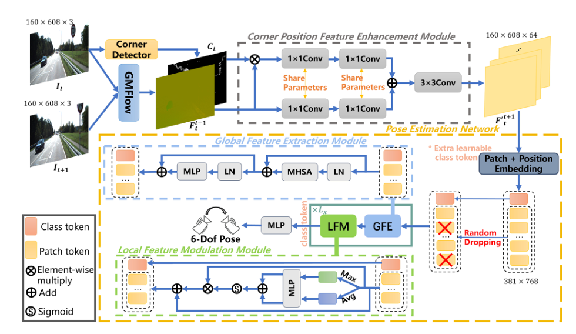

# CFRTDformer-VO: A Monocular Visual Odometry Based on Transformer with Enhanced Corner Position Features in Optical Flow and Random Token Dropping Training

## Declaration

This repository is the official repository for our paper titled "CFRTDformer-VO: A Monocular Visual Odometry Based on Transformer with Enhanced Corner Position Features in Optical Flow and Random Token Dropping Training," submitted to IEEE Robotics and Automation Letters (RA-L) on July 31, 2024. The paper is currently in the "Revise and resubmit" status. The release of the code aims to promote scientific exchange and transparency, and the code may be adjusted during the review process based on reviewer feedback.

## Abstract
Monocular Visual Odometry (VO) is a technique used to estimate a camera’s motion in 3D space from image sequences captured by a monocular camera. In this paper, we propose a Transformer-based monocular visual odometry method named CFRTDformer-VO, which uses optical flow as an intermediate representation to estimate the six-degree-offreedom relative pose between adjacent frames. The Transformer architecture excels at capturing global features, while optical flow effectively represents the geometric relationships between adjacent frames. To further improve pose estimation accuracy, CFRTDformer-VO incorporates a Corner Position Feature Enhancement module, which reduces the impact of inaccurate optical flow, and a Local Feature Modulation module, which enhances the representation of local features in the Vision Transformer. Additionally, we introduce a Random Token Dropping strategy during training to improve the model’s robustness and reduce overfitting. Evaluation on the KITTI odometry dataset shows that CFRTDformer-VO demonstrates competitive performance compared to existing advanced methods and achieves state-of-the-art results among learning-based methods that use only ground truth poses for supervision.



*Fig. 1. Network architecture of the proposed CFRTDformer-VO.*

## Dataset
Download the KITTI odometry dataset (color) [KITTI](https://www.cvlibs.net/datasets/kitti/eval_odometry.php).  
The data structure should be as follows:

- **CFRTDformer-VO/**
  - **data/**
    - **kitti/**
      - **00/**
        - **image_2/**
          - 000000.png
          - 000001.png
          - ...
      - **01/**
        - **image_2/**
          - 000000.png
          - 000001.png
          - ...
      - **poses/**
        - 00.txt
        - 01.txt
        - ...


## Pre-trained models
Here you find the checkpoints of our trained models.  
- Trained on sequences 00, 02, 08, and 09: [ckpt_sp1.pth](https://drive.google.com/file/d/1rAxpJ5O8P-PptUr7n1EzroDC-Oadgbdz/view?usp=sharing)
- Trained on sequences 00-08: [ckpt_sp2.pth](https://drive.google.com/file/d/1H3lLRwFpbVAx5TkqsPUR9K_Q7q81RPke/view?usp=sharing)

## Setup
Our project runs on Ubuntu 22.04. Create a virtual environment using Anaconda and activate it:
```bash
conda create -n cfrtdformer-vo python==3.10.8
conda activate cfrtdformer-vo
```
Install dependencies (with environment activated):
```bash
pip install -r requirements.txt
```

## Inference
Path to the trained model for inference: `CFRTDformer-VO/models/ckpt_sp1.pth`.

In the file `CFRTDformer-VO/CFRTDformerVO.py`, change `pretrained_path` to:
```bash
pretrained_path = 'models/ckpt_sp1.pth'
```
In the file `CFRTDformer-VO/vo_trajectory_from_folder.py`, modify `test-dir` and `pose-file` to the sequence you want to test, and save.

Run:
```bash
python vo_trajectory_from_folder.py
```

## LICENSE

MIT License

Copyright (c) 2024, JWang-hub. All rights reserved.

Permission is hereby granted, free of charge, to any person obtaining a copy
of this software and associated documentation files (the "Software"), to deal
in the Software without restriction, including without limitation the rights
to use, copy, modify, merge, publish, distribute, sublicense, and/or sell
copies of the Software, and to permit persons to whom the Software is
furnished to do so, subject to the following conditions:

The above copyright notice and this permission notice shall be included in all
copies or substantial portions of the Software.

THE SOFTWARE IS PROVIDED "AS IS", WITHOUT WARRANTY OF ANY KIND, EXPRESS OR
IMPLIED, INCLUDING BUT NOT LIMITED TO THE WARRANTIES OF MERCHANTABILITY,
FITNESS FOR A PARTICULAR PURPOSE AND NONINFRINGEMENT. IN NO EVENT SHALL THE
AUTHORS OR COPYRIGHT HOLDERS BE LIABLE FOR ANY CLAIM, DAMAGES OR OTHER
LIABILITY, WHETHER IN AN ACTION OF CONTRACT, TORT OR OTHERWISE, ARISING FROM,
OUT OF OR IN CONNECTION WITH THE SOFTWARE OR THE USE OR OTHER DEALINGS IN THE
SOFTWARE.

---


Portions of this project are derived from [TartanVO]( https://github.com/castacks/tartanvo) and [GMFlow](https://github.com/haofeixu/gmflow), and their LICENSEs are as follows:

TartanVO:

BSD License

Copyright (c) 2020, Carnegie Mellon University. All rights reserved.

Redistribution and use in source and binary forms, with or without modification, are permitted provided that the following conditions are met:

1. Redistributions of source code must retain the above copyright notice, this list of conditions and the following disclaimer.
2. Redistributions in binary form must reproduce the above copyright notice, this list of conditions and the following disclaimer in the documentation and/or other materials provided with the distribution.
3. Neither the name of the copyright holder nor the names of its contributors may be used to endorse or promote products derived from this software without specific prior written permission.

THIS SOFTWARE IS PROVIDED BY THE COPYRIGHT HOLDERS AND CONTRIBUTORS "AS IS" AND ANY EXPRESS OR IMPLIED WARRANTIES, INCLUDING, BUT NOT LIMITED TO, THE IMPLIED WARRANTIES OF MERCHANTABILITY AND FITNESS FOR A PARTICULAR PURPOSE ARE DISCLAIMED. IN NO EVENT SHALL THE COPYRIGHT HOLDER OR CONTRIBUTORS BE LIABLE FOR ANY DIRECT, INDIRECT, INCIDENTAL, SPECIAL, EXEMPLARY, OR CONSEQUENTIAL DAMAGES (INCLUDING, BUT NOT LIMITED TO, PROCUREMENT OF SUBSTITUTE GOODS OR SERVICES; LOSS OF USE, DATA, OR PROFITS; OR BUSINESS INTERRUPTION) HOWEVER CAUSED AND ON ANY THEORY OF LIABILITY, WHETHER IN CONTRACT, STRICT LIABILITY, OR TORT (INCLUDING NEGLIGENCE OR OTHERWISE) ARISING IN ANY WAY OUT OF THE USE OF THIS SOFTWARE, EVEN IF ADVISED OF THE POSSIBILITY OF SUCH DAMAGE.

GMFlow:

Copyright 2022, Haofei Xu

Licensed under the Apache License, Version 2.0 (the "License"); you may not use this file except in compliance with the License. You may obtain a copy of the License at http://www.apache.org/licenses/LICENSE-2.0

Unless required by applicable law or agreed to in writing, software distributed under the License is distributed on an "AS IS" BASIS, WITHOUT WARRANTIES OR CONDITIONS OF ANY KIND, either express or implied. See the License for the specific language governing permissions and limitations under the License.


## Acknowledgements

The implementation of this project would not be possible without the excellent code provided by [TartanVO](https://github.com/castacks/tartanvo) and [GMFlow](https://github.com/haofeixu/gmflow). We would like to thank the original authors for their outstanding work.